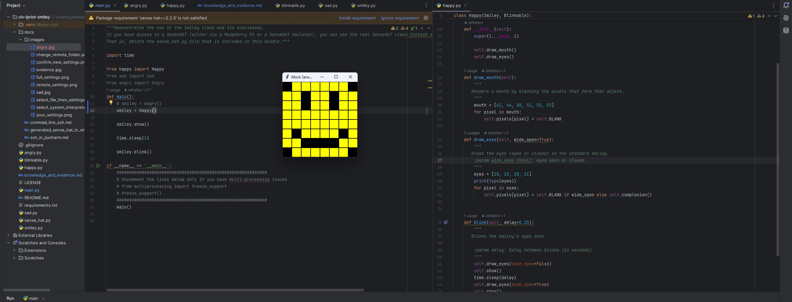
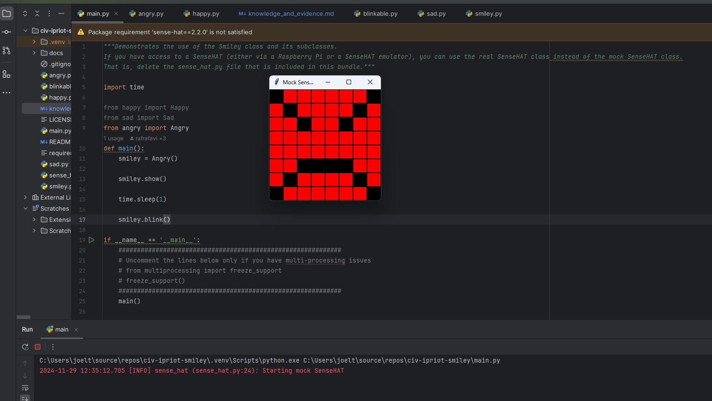

<style>

body {
    counter-reset: h2counter;
}

/* H1 - No numbering */
h1 {
    /* No counter reset or increment */
}

/* H2 - Level 1 numbering */
h2 {
    counter-reset: h3counter;
}

h2::before {
    counter-increment: h2counter;
    content: counter(h2counter) ". ";
}

/* H3 - Level 2 numbering */
h3 {
    counter-reset: h4counter;
}

h3::before {
    counter-increment: h3counter;
    content: counter(h2counter) "." counter(h3counter) " ";
}

/* H4 - Level 3 numbering (optional) */
h4 {
    counter-reset: h5counter;
}

h4::before {
    counter-increment: h4counter;
    content: counter(h2counter) "." counter(h3counter) "." counter(h4counter) " ";
}

</style>

# Evidence and Knowledge

This document includes instructions and knowledge questions that must be completed to receive a *Competent* grade on this portfolio task.

## Required evidence

### Answer all questions in this document

- Each answer should be complete, well-articulated, and within the specified word count limits (if added) for each question.
- Please make sure **all** external sources are properly cited.
- You must **use your own words**. Please include your full chat transcripts if you use generative AI in any way.
- Generative AI hallucinates, is not an authoritative source

### Make all the required modifications to the code

- Please follow the instructions in this document to make the changes needed to the code.

- When requested to upload evidence, upload all screenshots to `screenshots/` and embed them in this document. For example:

```markdown

```

- You must upload the code into your GitHub repository.
- While you can use a branch, your code should be in main when you submit.
- Upload a zip of this repository to Blackboard when you are ready to submit.
- You will be notified of your result via Blackboard
- However, if using GitHub classrooms, you may also receive additional feedback on GitHub directly

### Optional: Use of Raspberry Pi and SenseHat

Raspberry Pi or SenseHat is **optional** for this activity. You can use the included `sense_hat.py` file to simulate the SenseHat on your computer.

If you use a Pi, please **delete** the `sense_hat.py` file.

### Accessible version of the code

This project relies on visual patterns that appear on an LED matrix. If you have any accessibility requirements, you can use the `udl/accessible` branch to complete the project. This branch provides an accessible code version that uses text-based patterns instead of visual ones.

Please discuss this with your lecturer before using that branch.

## Specific Tasks & Questions

Address the following tasks and questions based on the code provided in this repository.

### Set up the project locally

1. Fork this repository (if not using GitHub Classrooms)
2. Clone your repository locally
3. Run the project locally by executing the `main.py` file
4. Evidence this by providing screenshots of the project directory structure and the output of the `main.py` file


If you are running on a Raspberry Pi, you can use the following command to run the project and then screenshot the result:

```bash
ls
python3 main.py
```

### Fundamental code comprehension

 Answer each of the following questions **as they relate to that code** supplied by in this repository (ignore `sense_hat.py`):

1. Examine the code for the `smiley.py` file and provide  an example of a variable of each of the following types and their corresponding values (`_` should be replaced with the appropriate values):

   | Type                                                                   | name   | value          |
   |------------------------------------------------------------------------|--------|----------------|
   | built-in primitive type  (bool, int, float, string)                    | dimmed | boolean (True) |
   | built-in composite type  (one that stores multiple vaules like a list) | pixels | list           |
   | user-defined type  (whatever is defined by  the class                  | WHITE  | (255,255,255)  |

2. Fill in (`_`) the following table based on the code in `smiley.py`:

   | Object                   | Type   |
   | ------------             |--------|
   | self.pixels              | list   |
   | A member of self.pixels  | tuple  |
   | self                     | Smiley |

3. Examine the code for `smiley.py`, `sad.py`, and `happy.py`. Give an example of each of the following control structures using an example from **each** of these files. Include the first line and the line range:

   | Control Flow | File     | First line         | Line range |
   | ------------ |----------|--------------------|------------|
   |  sequence    | happy.py | self.draw_eyes     | 39 to 43   |
   |  selection   | sad.py   | if wide_open:      | 26 to 29   |
   |  iteration   | sad.py   | for pixel in mouth | 16 to 17   |

4. Though everything in Python is an object, it is sometimes said to have four "primitive" types. Examining the three files `smiley.py`, `sad.py`, and `happy.py`, identify which of the following types are used in any of these files, and give an example of each (use an example from the code, if applicable, otherwise provide an example of your own):

   | Type                    | Used?            | Example                                                           |
   | ----------------------- |------------------|-------------------------------------------------------------------|
   | int                     | Yes              | eyes = [10, 13, 18, 21]   - the int represent the pixel postition |
   | float                   | Yes in happy.py  | delay = 0.25                                                      |
   | str                     | No               | welcome = "hello"                                                 |
   | bool                    | Yes in smiley.py | dimmed = True                                                     |


5. Examining `smiley.py`, provide an example of a class variable and an instance variable (attribute). Explain **why** one is defined as a class variable and the other as an instance variable.

> An example of a class variable is WHITE = (255,255,255). 
> WHITE is a class variable because it is defined in the class, but  not  within the instance (ie as part of the __init__ method)
> An example of an instance variable is pixels. This is because it is defined as part of the __init__ method, meaning each instance of Smiley can then have its own change of colour (such as changing the complexion towards the end of this project)
    
6. Examine `happy.py`, and identify the constructor (initializer) for the `Happy` class:    
   1. What is the purpose of a constructor (in general) and this one (in particular)?
   >    The constructor method is line 10 in happy.py where the __init__ function is called, and allows us to create an instance of the Happy class.
   >    In general, a constructor allows us to initialise an instance of the object with the required instance attributes.
   >    In this particular constructor, it creates an instance of a Happy, which is a subclass of Smiley. On top of the inherited dim_display and show methods, Happy also gains the ability to draw eyes, draw a mouth as well as blink
   
 
   2. What statement(s) does it execute (consider the `super` call), and what is the result?

   >    It creates a Smiley with a happy expression, and draws a mouth and eyes.
   >    However, before doing so, because the super call is run first, a SenseHat instance is created, drawing a 8x8 matrix with Yellow pixels (before any modifications)
   >

### Code style
[//]: # (ignore sensehat.py. it does not exist!)
1. What code style is used in the code? Is it likely to be the same as the code style used in the SenseHat? Give to reasons as to why/why not:
   
> The codestyle used is PEP8, as indicated by the variables using snake_case, but classes having their first letter capitalised (PascalCase)
> SenseHat is likely to use PEP8 as well, as the invocation of SenseHat (line 13 in smiley.py) is in PascalCase
 

2. List three aspects of this convention you see applied in the code.

> Some examples of this convention are 1) the dim_display using snake_case, 2) the constants for colours is expressed in all captialised letters in class Smiley, and 3) self is always used as the first argument to instance methods
>

3. Give two examples of organizational documentation in the code.

> both examples are from happy.py
> 1) in the class Happy, a docstring is used to comment the code, informing other developers what the class does 
> 2) in the draw_eyes function, a docstring is used to tell other developers what  this function does, as well as the type expected by wide_open (line 27)

### Identifying and understanding classes

> Note: Ignore the `sense_hat.py` file when answering the questions below

1. List all the classes you identified in the project. Indicate which classes are base classes and which are subclasses. For subclasses, identify all direct base classes.
  
  Use the following table for your answers:

| Class Name | Super or Sub? | Direct parent(s) |
|------------|---------------|------------------|
| Smiley     | Super         | No parent        |
| Happy      | Sub           | Smiley           |
| Sad        | Sub           | Smiley           |
| Blinkable  | Super         | No parent        |

2. Explain the concept of abstraction, giving an example from the project (note "implementing an ABC" is **not** in itself an example of abstraction). (Max 150 words)

> Abstraction is a way to implement a class which exposes the critical aspects of an object, and ignoring irrelevant details so that it can be used by more objects due to its general nature.
> An example of abstraction is the Blinkable class, which itself cannot be instantiation, but used as a base class instead.
> In this scenario, any Smiley that also inherits the Blinkable class will also inherit the blink method, but because it is set up as an abstract method, the implementation will have to be done in the subclass.
> This allows the Happy smiley can blink differently than if it were implemented in the Sad smiley. This means that they can both the general ability to blink, but it can be done in different ways

3. What is the name of the process of deriving from base classes? What is its purpose in this project? (Max 150 words)

> The process of deriving from base classes is inheritance. It makes our code more reusable, and can help us to better manage the complexity in our project
> For example, Happy and Sad classes inherit from the Smiley class, and are used to extend the functionality of Smiley, allowing us to easily draw different emotions
> By doing it this way, both Happy and Sad have the same attributes such as its size (8x8 matrix) as well as colours

### Compare and contrast classes

Compare and contrast the classes Happy and Sad.

1. What is the key difference between the two classes?
   > The key difference between the 2 classes comes down to their ability to blink as Happy inherits from both Smiley, and Blinkable, but Sad only inherits from Smiley

2. What are the key similarities?
   > Their similiarities come from the base class, such as their size (8x8 matrix) and the colours that the Smiley can be drawn in
   >
3. What difference stands out the most to you and why?
   > Becuase the Sad class does not inherit the blinkable class, the Sad smiley does not need to be blink in order to be instantiated, but the Happy class does. 

4. How does this difference affect the functionality of these classes
   > Because Sad does not inherit the blinkable class, the Sad smiley can implement a blink method which is not a prequisite in order to be instantiated, but the Happy class does
   >

### Where is the Sense(Hat) in the code?

1. Which class(es) utilize the functionality of the SenseHat?
   > The Smiley,Happy and Sad classes uses the functionality of the SenseHat.
   >
2. Which of these classes directly interact with the SenseHat functionalities? Which of the senseHat's functionality does it/ they  utilise
   > The Smiley class directly interacts with the SenseHat functionality in order to instantiate a SenseHat object 
   

3. Discuss the hiding of the SenseHAT in terms of encapsulation (100-200 Words)
   > The hiding of SenseHAT is to enforce boundaries, allowing us to only interact with the object via an interface instead.
   > This allows us to hide the complexity that comes with the SenseHAt object, and most of the complexity that comes with it

### Sad Smileys Can’t Blink (Or Can They?)

Unlike the `Happy` smiley, the current implementation of the `Sad` smiley does not possess the ability to blink. Let's first explore how blinking has been implemented in the Happy Smiley by examining the blink() method, which takes one argument that determines the duration of the blink.

**Understanding Blink Mechanism:**

1. Does the code's author believe that every `Smiley` should be able to blink? Explain.

> No. As only the Happy class has inherited the Blinkable method through an abstract method, only a Happy Smiley must blink
> The Sad class does not call the Blinkable class, and therefore the author did not want it to be able to blink
> 

2. For those smileys that blink, does the author expect them to blink in the same way? Explain.

> Yes. Because of the way the colours have been defined in the if statement (line 31 in happy), all happy smileys will blink the same way
> If the author wanted the ability to control the way each instance of a Happy Smiley blinking, they could've included it as a parameter in the draw_eyes attribute instead
>

3. Referring to the implementation of blink in the Happy and Sad Smiley classes, give a brief explanation of what polymorphism is.

> Polymorphism refers to the ability of different classes implementing the same methods to perform different behaviours
> In the Smiley example, both happy and sad have their own methods to draw a mouth, but because of polymorphism, we are able to draw different shapes with it


4. How is inheritance used in the blink method, and why is it important for polymorphism?

> By creating blink as an abstract method, we are able to ensure the happy smiley is able to inherit the blink method, and that it gets implemented. 
> This is important for polymorphism as it allows for the happy, and if we choose to implement it in the Sad class as well, to allow it be implemented in dependently (ie happy and sad can blink differently)
>
1. **Implement Blink in Sad Class:**

   - Create a new method called `blink` within the Sad class. Ensure you use the same method signature as in the Happy class:

   ```python
   def blink(self, delay=0.25):
       pass  # Replace 'pass' with your implementation
   ```

2. **Code Implementation:** Implement the code that allows the Sad smiley to blink. Use the implementation from the Happy Smiley as a reference. Ensure your new method functions similarly by controlling the blink duration through the `delay` argument.

3. **Testing the Implementation:**

- Test the new blink functionality on your Raspberry Pi or within the Python classes provided. You might need to adjust the `main.py` script to incorporate Sad Smiley's new blinking capability.

Include a screenshot of the sad smiley or the modified `main.py`:


- Observe and document the Sad smiley as it blinks its eyes. Describe any adjustments or issues encountered during implementation.

  > I initially tried to call the Sad class  (line 10 in main, smiley = Sad()) but neglected to first import it (line 8), which led to a Name error where Sad was not defined. However, this was an easy fix

  ### If It Walks Like a Duck…

  Previously, you implemented the blink functionality for the Sad smiley without utilizing the class `Blinkable`. Assuming you did not use `Blinkable` (even if you actually did), consider how the Sad smiley could blink similarly to the Happy smiley without this specific class.

  1. **Class Type Analysis:** What kind of class is `Blinkable`? Inspect its superclass for clues about its classification.

     > Blinkable is an abstract class, as the parent is created by calling ABC 

  2. **Class Implementation:** `Blinkable` is a class intended to be implemented by other classes. What generic term describes this kind of class, which is designed for implementation by others? **Clue**: Notice the lack of any concrete implementation and the naming convention.

  > A generic term is an Abstract Base Class. 

  3. **OO Principle Identification:** Regarding your answer to question (2), which Object-Oriented (OO) principle does this represent? Choose from the following and justify your answer in 1-2 sentences: Abstraction, Polymorphism, Inheritance, Encapsulation.

  > This represents Polymorphism. Due to the lack of concrete implementation, this allows us to change the behaviour of the method in the class in which it is implemented 

  4. **Implementation Flexibility:** Explain why you could grant the Sad Smiley a blinking feature similar to the Happy Smiley's implementation, even without directly using `Blinkable`.

  > This is because of the way the Smiley class has been set up. Because Smiley is set up as polymorphic, we are able to implement the Happy and Sad classes differently. 

  5. **Concept and Language Specificity:** In relation to your response to question (4), what is this capability known as, and why is it feasible in Python and many other dynamically typed languages but not in most statically typed programming languages like C#? **Clue** This concept is hinted at in the title of this section.

  > This capability is known as polymorphism, and is feasible due to the concept known as Duck Typing. In dynamically typed languages, we do not need to explicitly define the typology. Polymorphic objects just require it to have the neccessary attributes and methods passed into it.
  > Statically typed languages are not able to do this adhoc type implementation as they will require the typology to be defined ahead of time and we will need to be more intentional about the types and how they relate.

  ***

  ## Refactoring

  ### Does a Smiley Have to Be Yellow?

  While our current implementation predominantly features yellow smileys, emotional expressions like sickness or anger typically utilize colors like green, red, or orange. We'll explore the feasibility of integrating these colors into our smileys.

  1. **Defined Colors and Their Location:**

     1. Which colors are defined and in which class(s)?
        > Colours are defined in the Smiley class. We have 5 colours predefined (White, Green, Red, Yellow and Blank)
     2. What type of variables hold these colors? Are the values expected to change during the program's execution? Explain your answer.
        > These are stored in a constant. We do not expect these values to change as it has been expressed in all capitals, indicating that they are constants
     3. Add the color blue to the appropriate class using the appropriate format and values.
        > add screenshot

  2. **Usage of Color Variables:**

     1. In which classes are the color variables used?
        > The colours are used in the Happy and Sad classes when drawing the eyes, as well as the Smiley class to define the general colour of the Smiley instance

     3. **Simple Method to Change Colors:**
        4. What is the easiest way you can think to change the smileys to green? Easiest, not necessarily the best!
     > We could look for every instance of YELLOW and manually change them to GREEN instead

  Here's a revised version of the "Flexible Colors – Step 1" section for the smiley project, incorporating your specifications for formatting and content updates:

  ### Flexible Colors – Step 1

  Changing the color of the smileys once is straightforward, but it isn't very flexible. To facilitate various colors for smileys, it is advisable not to hardcode values in any class. This approach was identified earlier as a necessary change. Let's start by removing the built-in assumptions about color in our classes.

  1. **Add a method called `complexion` to the `Smiley` class:** Implement this instance method to return `self.YELLOW`. Using the term "complexion" instead of "color" provides a more abstract terminology that focuses on the meaning rather than implementation.

  2. **Refactor subclasses to use the `complexion` method:** Modify any subclass that directly accesses the color variable to instead utilize the new `complexion` method. This ensures that color handling is centralized and can be easily modified in the future.

  3. **Determine the applicable Object-Oriented principle:** Consider whether Abstraction, Polymorphism, Inheritance, or Encapsulation best applies to the modifications made in this step.

  4. **Verify the implementation:** Ensure that the modifications function as expected. The smileys should still display in yellow, confirming that the new method correctly replaces the direct color references.
    

  This step is crucial for setting up a more flexible system for color management in the smiley display logic, allowing for easy adjustments and extensions in the future.

  ### Flexible Colors – Step 2

  Having removed the hardcoded color values, we now enhance the base class to support dynamic color assignments more effectively.

  1. **Modify the `__init__()` method in the `Smiley` class:** Introduce a default argument named `complexion` and assign `YELLOW` as its default value. This allows the instantiation of smileys with customizable colors.

  2. **Introduce a new instance variable:** Create a variable called `my_complexion` and assign the `complexion` parameter to it. This step ensures that each smiley instance can maintain its own color state.

  3. **Rationale for `my_complexion`:** Using a distinct instance variable like `my_complexion` avoids potential conflicts with the method parameter names and clarifies that it is an attribute specific to the object.

  4. **Bulk rename:** We want to update our grid to use the value of complexion, but we have so many `Y`'s in the grid. Use your IDE's refactoring tool to rename all instances of the **symbol** `Y` to `X`. Where `X` is the value of the `complexion` variable. Include a screenshot evidencing you have found the correct refactor tool and the changes made.

  

  5. **Update the `complexion` method:** Adjust this method to return `self.my_complexion`, ensuring that whatever color is assigned during instantiation is what the smiley displays.

  6. **Verification:** Run the updated code to confirm that Smileys still defaults to yellow unless specified otherwise.

### Flexible Colors – Step 3

With the foundational changes in place, it's now possible to implement varied smiley colors for different emotional expressions.


1. **Adjust the `Sad` class initialization:** In the `Sad` class's initializer method, change the superclass call to include the `complexion` argument with the value `self.BLUE`, as shown:

       ```python
       super().__init__(complexion=self.BLUE)
       ```

    2. **Test color functionality for the Sad smiley:** Execute the program to verify that the Sad smiley now appears blue.

    3. **Ensure the Happy smiley remains yellow:** Confirm that changes to the Sad smiley do not affect the default color of the Happy smiley, which should still display in yellow.

    4. **Design and Implement An Angry Smiley:** Create an Angry smiley class that inherits from the `Smiley` class. Set the color of the Angry smiley to red by passing `self.RED` as the `complexion` argument in the superclass call.
    
    ***
